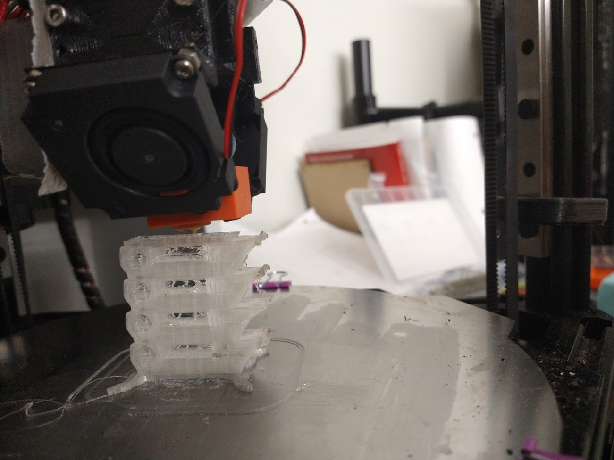
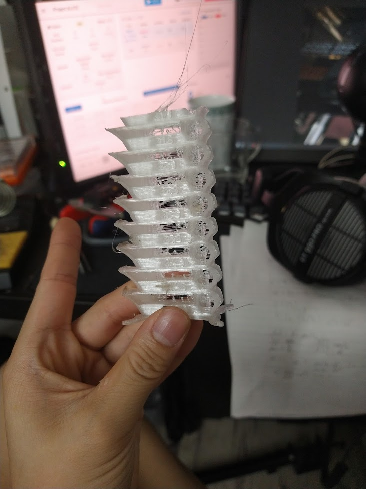

Welp, now that I've sorted out my problems with the Dragon, it's time to calibrate Alice! My goal here is to make her able to print as well as Chase (Fanatical Detail Maniac on the 3d printing discord) can. That's a high goal, considering how detailed his prints are


So first step: Calibrating esteps. That's easy. Turn on cold extrude, extrude 100mm, measure, see that it's not 100mm, and adjust calibration. That is, set esteps to be

```e_steps = (esteps * 100)/(extruded)```
e.g for me my esteps were set to 400, and I extruded 97.8mm according to my calipers. So I set my new esteps to (400 * 100)/(97.8) = 408.99. Extrude again, and I get as close to 100 as I'm going to get. Sometimes you might have to repeat this a couple times.

Ok next up: Flow calibration. This one's a little more involved. So step 1, import a cube into your slicer (I like Prusaslicer), and then slice it in Vase mode. Then print it, and measure each side (in the same place, i.e, in the middle each time), and average out the measurements.


On my first try, I got `0.37, 0.39, 0.41, 0.39`, which averages out to 0.39mm, so I need my flow to be (0.4 * 100)/(0.39) = 102.56%. So let's set that as the new flow value and print another calibration cube!

Pass #2 gives me `0.39, 0.42, 0.42, 0.41, 0.40, 0.41, 0.36, 0.37`, which averages out to 0.3975mm... so I think that's good enough?

Onto temperature calibration! Now most people calibrate their PLA to print somewhere between 180C and 220C but after reading [this paper](https://link.springer.com/content/pdf/10.1007/s00170-018-2664-8.pdf) it seems that I should test my temp tower with higher temps. So we're doing 250 to 200C.



So far so good! You can see how the filament is a little burnt on the 250C layer but that's ok. The stringing is because retraction is still set to 0, but notice how the filament sets on the different layers at the overhang: At 245C the overhang edge is nice and flat, while at the lower temperatures, it curls upwards - which means that the temperature is too low and the internal stresses are not relieved (Not backed up by scientific evidence, but that's what my gut is telling me is why this happens).




Well... when it hit 210C, the temp tower was too tall and not wide enough and the nozzle knocked it off. In any case, you can clearly see that there's 2 temperatures at which it seems to lay flat and not curl - 220C and 245C. Why is this? I have no idea. But I'll say that it's more complicated than my original idea. In any case, judging off of this tower and the paper above, I'm going with 245C as my printing temperature for this (3D Printing Canada's transparent PLA).

Next up... Retraction! Alas, when I tried to do this, my bowden adapter died and so I'll have to put off finishing calibration until after I get a new one and reprint the part that holds the adapter...
