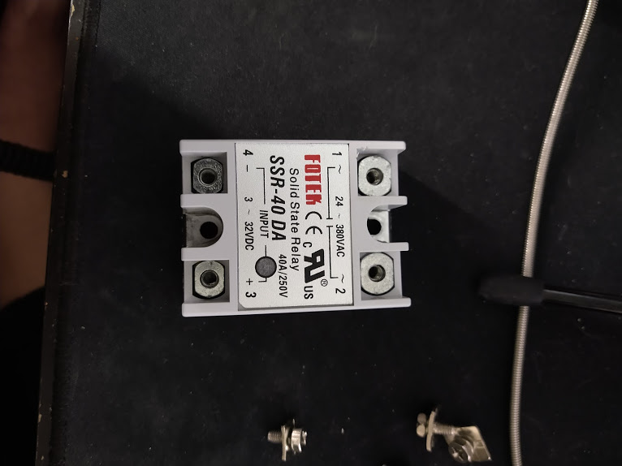

Ok, so I figured out what was wrong with my PTC heater and why it wouldn't work! Turns out that my SSR was a fake Fotek - they had the cut, not rounded lower corner, the "Made in Taiwan" instead of "Taiwan Made" text on the labelling, and it lacked the "Rated: 25A Max" text. The secret to getting it work? Switch it with 12V input instead of 3-5V input. But the fan output on the Jabberwocky's board only outputs 5V so... not a viable alternative for me. 

Swapping out the fake Fotek for a real Panasonic AQA211VL, and voila! It worked perfectly! At least, on the hardware side anyways - the software side was a little bit more complicated. Now the Jabberwocky uses the Ultimaker 2 main board, which breaks out pins on the ATMEGA2560 that aren't defined in the Arduino pins.h definition - you need to replace your `pins_arduino.h` file with [this one](https://gist.github.com/notLiria/93a6b694a6cb7102cd0424e1f5ffdf82)

What this version of `pins_arduino.h` does is that it exposes additional pins (which things are attached to on the Ultimaker 2 mainboard) to Marlin. Depending on how you're building Marlin, this will either be under `./platformio/packages/framework-arduinoavr/variants/mega` or under the Arduino directory's pin definition folder. This will allow you to go and use pin 77 (Which goes to J34 on the board) to switch the SSR with 5V! 

In addition to this, you'll have to go and attach a thermistor to J9 (With a voltage divider using a 4.7k resistor) in order to get a thermistor input... but I still haven't gotten that working. From the circuit though, J9 goes to ADC15, which is also known as pin 69 to the modified `pins_arduino.h` file. I think that the reason why it doesn't work for me though is quite simple - I believe that I've flipped the voltage divider is all. 

But of course, none of this is relevant to me anymore as I have somehow burned out the Ultimaker 2 main board that it comes with, and so I'm switching over to a Duet.... even though my wallet cries. 