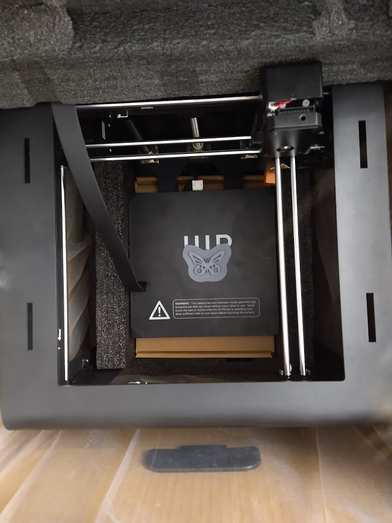

So last week the Monoprice Maker Ultimate (A ripoff of the Wanhao D6) was on sale on Monoprice as openbox for $240 USD + $85 USD shipping to Canada. I was initially suspicious on how good this printer was, but Karl on the 3dprintingdiscord convinced me with this list of reasons

1. Thick, stiff, welded, powder coated panel frame
2. Enclosure-enabled out of the box - just buy panels and screw them in
3. Ultimaker motion system with the Zortrax dual crossbars
4. Polymer bushings on sliderblocks (probably not genuine igus but I can't be sure)
5. Genuine Gates closed-loop belts
6. Genuine Meanwell 350W PSU
7. Metal parts for all mechanics - no printed parts here
8. Self aligning radial bearings supporting the shafts
9. Ballscrew driven Z axis
10. 3-point leveling bed with stiff springs and stiff carriages - holds level extremely well
11. Properly flat, 6mm aluminum bed plate
12. 240W bed heater - reaches 130C out of the box
13. Built-in LED lighting with software-controllable brightness
14. It's EOL and Monoprice is liquidating their remaining Open Box stock for who knows how long, so if you don't now you may never get the chance to again

So I bit the bullet and ordered it. RIP $450 CAD (ouchie conversion rates suck). I spent a couple days bemoaning how much money I had just spent - but all of this was gone the moment that I opened it up.

Look at it. Even in the box, it's so beautiful. I have joined the cult! But on a serious note, this printer *screamed* quality at me just from being inside the box - stiff (aluminum?) metal panels, stiff crossbar... I couldn't bend or rock this thing even if I wanted to! And look at this beautiful toolhead, with a nice ribbon cable holding all of the cables. Anyways, it seems that since Karl wrote that copypasta from above, they've switched to clone belts. But they've also switched to Moons steppers. So ... I don't know whether to call that an upgrade or not.

A bit tired of admiring it, I plugged it in and checked out the print time on it. Somebody had been running this machine for 178H and printed for a total of 118, a fair number of hours.

Then I hit "Home". My god, that was beautiful - the sounds that the entire printer makes, as the steppers whir it to the home position, is exactly what I had always envisioned a 3d printer should look and sound like - mechanical, solid, and most of all, "clunk clunk cluk". And as this printer was exactly as much of a beast as I thought it would be, I have christned it The Jabberwocky! Now, this printer ships with a PTFE lined hotend... which will not do for my intended purposes of printing ABS and PC with it. So the hotend went, and in goes a Microswiss. I forgot to take pictures of the installation, but it's exactly as straightforwards as the manual makes it out to be.

Anyways, my open box printer did *not* come wih a filament holder, so I quickly searched on Thingiverse for a solution that would require little to no external hardware, linking me to [this](https://www.thingiverse.com/thing:3736724). Not the best, but it'll work right?

So let's give her a while and a print. Stuck in some Overture black PETG, set up a profile quickly in Prusaslicer, and set it to print! And print it did - for about 30 minutes. And then it TRP'd.
!(Jabberwocky failure)[./jabberfail.jpg]

Now why did it TRP... I'm not sure, but I ran a PID tune and tried again. And this time it worked! First successful print, Overture black PETG at 260C (Yes I know it's high), with bed temp of 80C

Not the best print quality... But for 0 tunning out of the box except for flashing a Marlin hex file I found on github for this printer? Pretty damn good. Anywasy, as it printed I did something mildly janky: I cut up pieces of cardboard, punched holes with a M3 allen key, and screwed in some cardboard panels in (Because I don't have acrylic ones).

Anyways, that... keeps the inside warm. So next up, I wanted to install the SSR into it for a chamber heater. So I flipped it over and opened it up. The electronics in this printer are really nicely done and wired quite nicely - real Meanwell 350W PSU, nicely done cables and shielding even on the ribbon cables!

Ok, SSR installed!

Now I have the question of how do I hook this thing up? Well my PTC heater takes a 24V fan and mains for the heater. So I tried to go and connect the fan and J20 on the board together to the input side of the SSR. Problem: This is always on. Whoops. Unplugged that, and connected it to the 5V fan output. PTC fan surprisingly does turn on, even though it's being driven by 5V... but the PTC heater itself doesnt' turn on. Which is weird because the SSR is being driven high so the heater *should* be turning on, and even when I touch my hand to it, it's still cold. So something's clearly wrong there. Oh yes, and J9 is used for analog input of a thermistor (NTC 100K with a 4.7K voltage divider, middle pin is 5v, right pin is ground, and left pin is the middle of the voltage divider, you can see a picture [here](https://3dprint.wiki/reprap/wanhao/duplicator6/major_components/motherboard)).

Aaaaaaand the software doesnt' work. Well... it does. Kind of. It seems as if Marlin doesn't want to play nicely with the PTC heater or the thermistor - it's tracking the bed instead with the thermistor and the PTC heater is always on and won't turn off. Anyways, this post has rambled on long enough, enjoy some more pictures (Courtesy of someone else) of the Monoprice Maker Ultimate [here](https://imgur.com/a/hzTTgu8)

