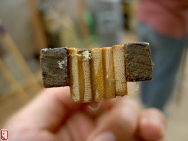
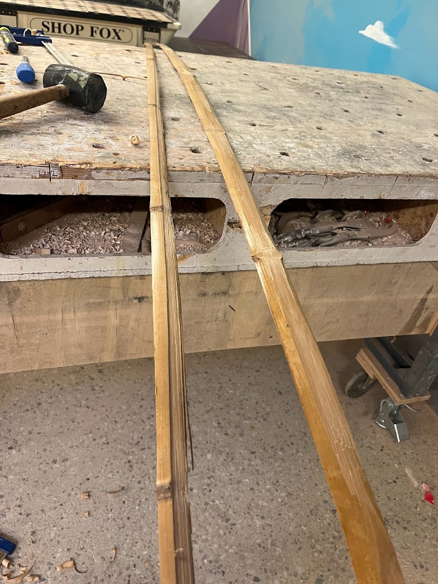

So, a few years ago, before the whole pandemic-y thing happened, I bought some moso bamboo from a place in Toronto, and some Madake bamboo from Jaap Koppedrayer, for the purpose of creating a bow. 

Then the pandemic happened and I had to move so I no longer had space to build that bow. Of course, now it's 2022, and I still dont' have space to make a bow - but what I do have now is regular access to the local makerspace. 

So in true me fashion, I'm going to pick up where I left off: Creating a vertically laminated bow, the way that the Japanese did (And the ancient chinese and south indians did). 

So we're going to make a core like this 

This is a core made by one of the Shibatas (I don't know which Shibata, just know that it was one of them), consistiting of 2 layers of hardwood on either side and 5 pieces of bamboo in between. 

Note that in bamboo, the fibers that give the most "oomf" to the bow are the so-called power fibres, which lay juuuuust under the surface level of the bamboo. So planing the bamboo this way 

Is actually a huge mistake. Note that because we've cut it that way, we've actaully sheared off most of the power fibres. 

Lessons learnt: Cut the bamboo into smaller, thinner strips and *then* plane it so that they're flat. That will give you more power fibres that way. 