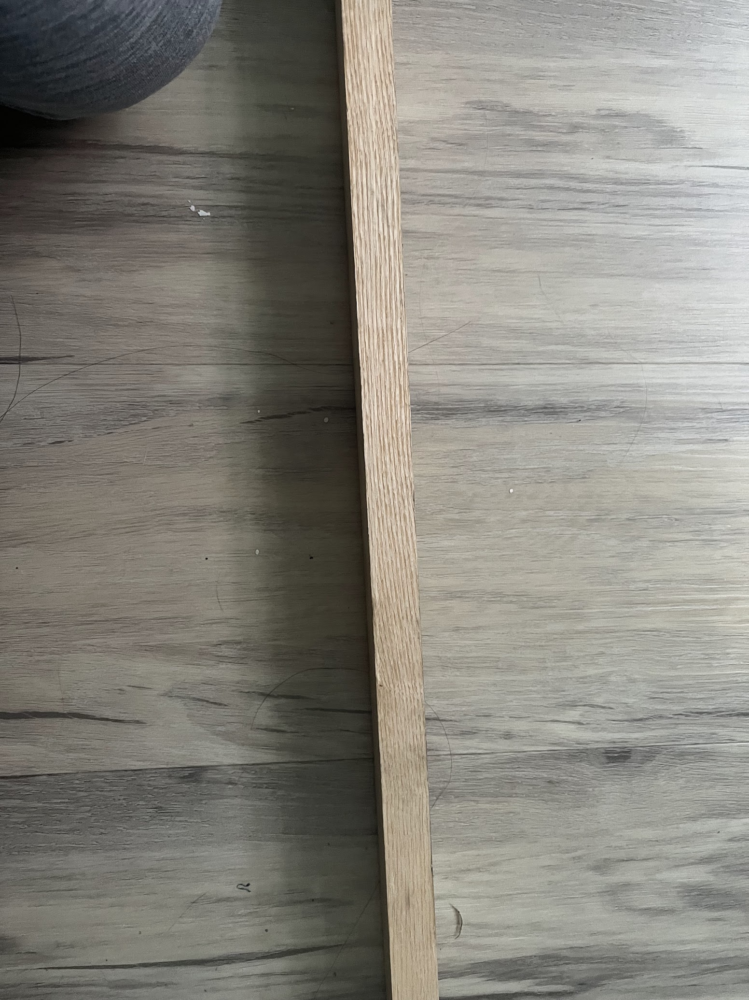

Ok, so last week we went and we planed down 2 pieces of bamboo flat. That was a royal pain, but there's still 4 more strips of bamboo to plane flat. 

In addition to that, I did some research on types of wood to use for the core. From talking to Jaap a few years ago, he said that maple and oak specifically are no good - maple is too unstable and oak is too brittle. From my understanding, this is because maple is too unstable when used in narrow strips, like we would on this bow. 

In fact, Jaap prefers tropical hardwoods - specifically [in this video](https://youtu.be/1zl0av0bQ7k?t=1107) he says that he prefers "brittle, lightweight hardwoods" and "tropical hardwoods", and specifically mentions cherry. I've heard/seen him make bows using purpleheart, padauk, bloodwood, wenge, ash and leopardwood. 

So I made a trip to the local wood store. The cheapest one of those turned out to be Ash, and I found a board of ash with some pretty good grain in it for $10. 

So I will cut out 2 strips of ash from this, each strip 13mm thick by 8-10mm wide. The total width that we're aiming for is a 30mm core with 10mm thickness at the center and 5mm (Or less) thickness at each end, with ~18mm of bamboo and ~12mm of wood. I'm cutting the wood to 8-10mm instead of 6mm so that I can shave it down easily after. 