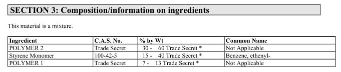
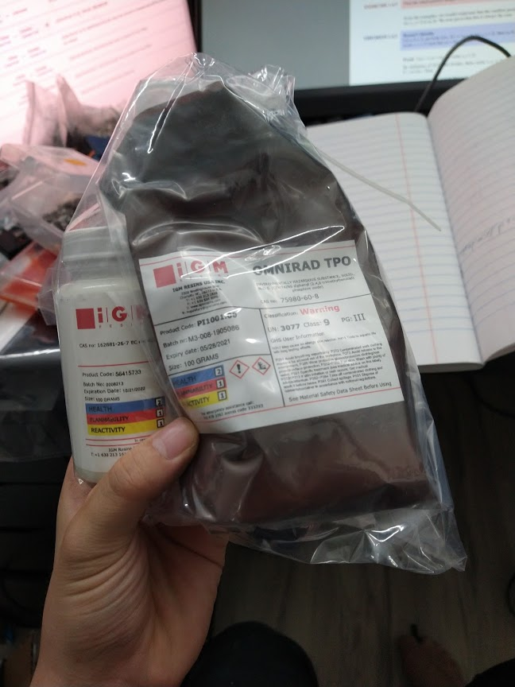

Ok, so my move is done, and now I am in a slightly better place to look at the resin stuff. This is what I've found: 
Photopolymers (Like uv curing resins for 3d printing) use at least 3 different components: 
- Photoinitiator
- Oligomer
- Monomer

The way that these photopolymers work is that when it is exposed to light of an appropriate wavelength, the photoinitiator gives off chemicals/starts a reaction that causes the oligomers to link to the monomers. This causes it to solidfy. In the case of Bondo Fibreglass Resin, according to the datasheet, it is 15-40% Styrene Monomer, 30-60% TRADE SECRET and 7-13% TRADE SECRET. 

That's a lot of trade secrets. Now Bondo Fibreglass Resin itself isn't a photocuring resin, so it can skip the photoinitiator. But the curing process works the same - oligomers link to polymers, causing it to solidify. Looking up polyester resins, it seems that this is likely an isophthalic polyester resin due to its usage for fibreglass, so we'll just guess that that's that. 

I also went and contacted IGM Resins to get a sample of Igracure 819 for this project and they happily sent me some! 

Now an additional component present in UV curing resins is actually a UV blocker - it's apparently quite easy to expose the resin to too much UV light and over cure it, so that's something I'm going to have to look into...

Finally, here are some patents and some of the papers that I've been reading 
- Stratasys's polyjet resin: https://patents.google.com/patent/US5855836A/en
- Another Stratasys polyjet resin: https://patents.google.com/patent/US6133355A/en
- Stratasy's actual patent on polyjets: https://patents.google.com/patent/US6841116B2/en 
- Resin on a FDM system extrusion: https://ojs.unsw.adfa.edu.au/index.php/juer/article/view/1189/812

This weekend I'm going to mix together a small sample of resin (100mL) and see what happens. 