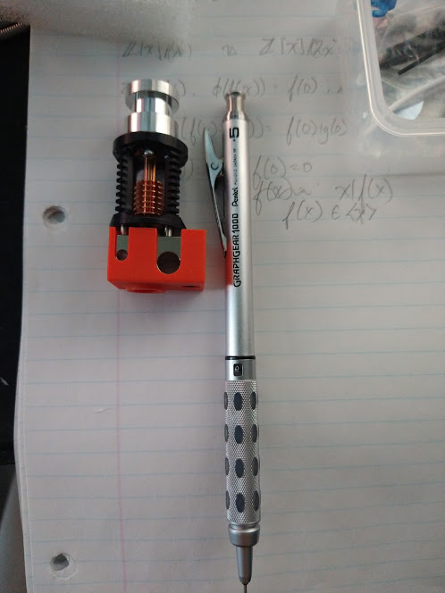
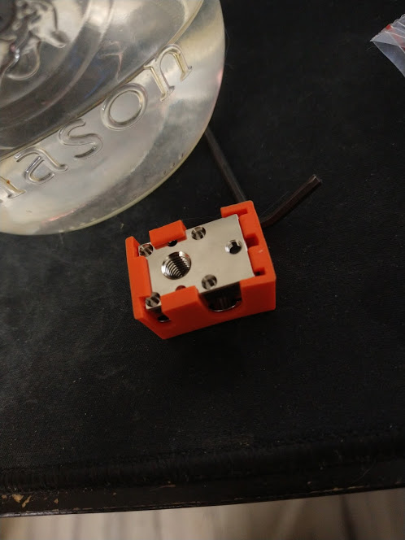
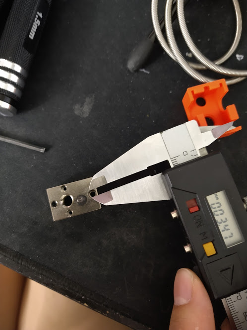
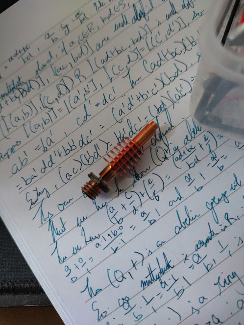
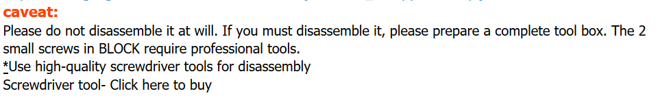

So a couple weeks ago, I killed the old V5 clone that came with my Monoprice D1 (RIP), and in an impulsive fit, I went and dropped the money on a Trianglelab Dragon, getting it fedexed over here. 

Whoops. Well anyways, after my wallet cried and it got here, I was super excited - I would finally have a hotend again and be able to print after like 2 weeks! But the first thing that I noticed was that it's tiny!

 

Just the heatsink of the V5 is bigger than the entire Dragon assembly. The next thing that I noticed was how heavy it is - TL says that it's a solid copper heatblock and I can believe it. The heatblock alone weighs in at about 32 grams, which is pretty solid - the V5 heatsink weighs in at 35 grams and the V6 one at 20 grams and the entire V6 assembly at about 50 grams 

The next thing that I noticed was that the quality of the assembly was very high - everything was well put together and feels nice y'know? It feels premium. And I guess that's a good feeling. 

Now, the not so nice part: 

You see this heatblock? It's got 9 holes in it - 4 are not threaded and 5 are threaded. The 4 non threaded holes are 2.3mm in diameter, and it's where the (press fit!) 2.3mm x 7.5mm hollow pins sit. But they're fragile. Extremely fragile. Like jesus I don't know how to stress this - maybe I'm just super clumsy but these pins are super fragile. More on that in a bit. 
e
The next holes are 2 1.27mm hex screws which actually screw into the heatsink. That is, your hotend is really just being held in place by 2 1.27mm screws. That's... A little bit fragile I guess, but still an improvement over the V6/V5 mounting design which just used the heatbreak as a mounting pin. 

Now the remaining holes: One is for the heatbreak, one is for a thermistor, one is for the heater cartridge. 

With regards to the heatbreak: You need to install it and tighten it with the provided wrench... but you can't turn the heatbreak with the wrench until you remove the really finicky pins. Mildly annoying design choice, but ok. 

Next up is the thermistor screw. Pretty standard tiny little grub screw. Not sure what the  size is, but it's usabele. 

And finally, there's the heater cartridge screw. A little M2.5 pan head. Or at least, that's what it looks like - they give you a M2.5 allen key and it fits. But removing the screw... 

That... A M3 hole. Yes, that's a M3 hole with a M3 threaded screw that uses a M2.5 pan head on top. That is odd. 

Oh right and I forgot to mention - the box comes with an entire kit for the dragon, containing a groovemount adapter, screws for said groovemount adapter, screws for scremounting the Dragon, (I think they're M2 screws), a copper plated nozzle, a wrench to take apart the heatbreak, and M1.27, M1.5, M2.5, and M3 allen keys.

So I went and installed it and used it. Without heat tightening it. Because I listened to the internet which said that you don't have to heat tighten. 

You see, that was a mistake. 

HEAT TIGHTEN YOUR DRAGON WHEN YOU INSTALL THE NOZZLE.

PLA spewed everywhere. And then I tried to get it off by heating the block up to 350C for an hour. Whoops. 

[Burnt dragon](./burnt_dragon.jpg)

Yea so uh ... heat tighten your nozzle. And your heatbreak. Oh right you remember how I mentioned that the bloody pins are fragile? Well when I was disassembling the Dragon to try to save the heatblock at least, the PLA had melted into the pins... and I took a pair of pliers, put them inside the pin  and pulled. And crushed the pin.

They are fragile. Be very careful. And heat tighten your nozzle. This is also where I learnt that the heater cartridge uses M2.5 pan head with a M3 thread. I have flooded this heatblock and am unable to remove the heater cartridge, but this is ok because I bought a spare because I was smart about this. 

So lessons learnt with the dragon: 
- Heat tighten even if it says don't heat tighten
- Don't disassemble it unless you absolutely have to 
- Replace the M2.5 pan head holding in the heater cartridge with a M3 socket cap. 

But in terms of performance? It works pretty well. It held 350C for over an hour and had no problems printing after - but the colour does change. 

I don't have enough data right now though to tell you anything about things like thermal performance though - that'll come later. 

In summary: The Dragon is a high quality hot end that looks and feels premium. However, it is a little bit of a finicky beast and does not take well to disassembly. Like the TL page for the Dragon says: 
